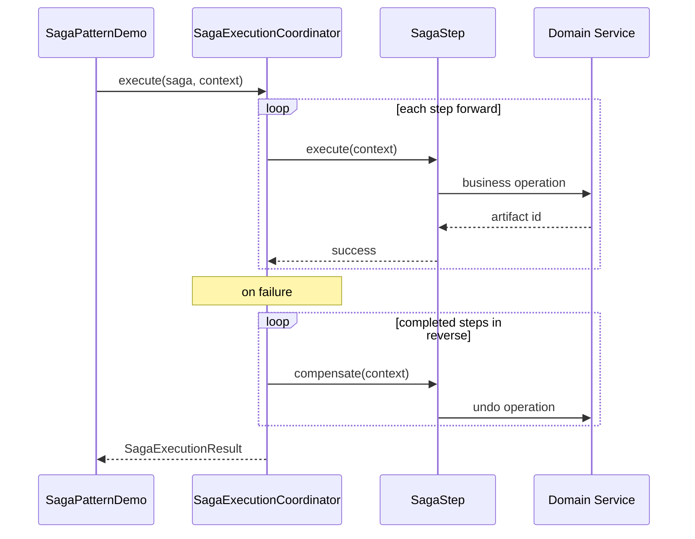

# Saga Pattern — Distributed Transaction Management

This document explains the **Saga pattern** implemented in this package: theory, trade-offs, architecture, code walkthrough, and interview talking points.

---

## Table of Contents

1. [Problem Statement](#problem-statement)
2. [What Is a Saga?](#what-is-a-saga)
3. [Saga vs Alternatives](#saga-vs-alternatives)
4. [Orchestration vs Choreography](#orchestration-vs-choreography)
5. [Demo Scenario: Place Order](#demo-scenario-place-order)
6. [Architecture Overview](#architecture-overview)
7. [Package Structure](#package-structure)
8. [Core Framework](#core-framework)
9. [Order Domain](#order-domain)
10. [Execution Flows](#execution-flows)
11. [Design Decisions](#design-decisions)
12. [Running the Demo](#running-the-demo)
13. [Production Considerations](#production-considerations)
14. [Interview Talking Points](#interview-talking-points)
15. [Further Reading](#further-reading)

---

## Problem Statement

In a microservices architecture, a single business operation often spans multiple services. For example, **placing an order** may require:

1. Creating an order record
2. Charging the customer
3. Reserving inventory
4. Scheduling delivery

Each service owns its own database. You **cannot** wrap all four updates in a single ACID transaction across service boundaries without a distributed transaction protocol.

**Challenges without sagas:**

- Partial failure leaves the system inconsistent (order created but payment failed)
- Two-phase commit (2PC) is slow, brittle, and poorly supported across heterogeneous systems
- Manual rollback logic scattered in application code becomes unmaintainable

The Saga pattern provides a **structured way to maintain eventual consistency** across services.

---

## What Is a Saga?

A **saga** is a sequence of **local transactions**, where each step:

1. Performs a business action in one service (forward transaction)
2. Exposes a **compensating transaction** that semantically undoes that step if a later step fails

If step *N* fails, steps *1 … N−1* are compensated **in reverse order**.

```text
Forward:   CreateOrder → ProcessPayment → UpdateInventory → DeliverOrder
Backward:  (fail at UpdateInventory)
           ← RefundPayment ← CancelOrder
```

**Key properties:**

| Property | Description |
|----------|-------------|
| **No global lock** | Each service commits its own local transaction independently |
| **Eventual consistency** | System may be temporarily inconsistent during compensation |
| **Compensation ≠ rollback** | Compensating actions are business-level undo (refund, cancel), not DB rollback |
| **Idempotent compensation** | Compensations may be retried; they must be safe to run more than once |

---

## Saga vs Alternatives

| Approach | How it works | Pros | Cons |
|----------|--------------|------|------|
| **2PC (Two-Phase Commit)** | Coordinator prepares all participants, then commits or aborts | Strong consistency | Blocking, single point of failure, poor cross-service support |
| **TCC (Try-Confirm-Cancel)** | Each service has try/confirm/cancel phases | Fine-grained control | Complex API design; every service must implement three operations |
| **Saga** | Forward steps + compensating steps | Simple per-service APIs, scales well | Eventual consistency; compensation logic required; no isolation guarantee |
| **Outbox + events** | Publish events after local commit; consumers react | Decoupled, audit trail | Harder to reason about global failure; often combined with saga |

**When to use Saga:**

- Long-running business processes across microservices
- You can define meaningful compensating actions
- Brief inconsistency windows are acceptable (e.g., order exists for seconds before cancellation)

**When not to use Saga:**

- You need strict ACID across services in real time
- Compensation is impossible (e.g., email already sent, physical shipment dispatched)

---

## Orchestration vs Choreography

This demo implements **orchestration**.

### Orchestration (central coordinator)

A **Saga Execution Coordinator** tells each service what to do and in what order.

```text
                    ┌─────────────────────────┐
                    │ SagaExecutionCoordinator│
                    └───────────┬─────────────┘
                                │
          ┌─────────────────────┼─────────────────────┐
          ▼                     ▼                     ▼
   CreateOrderStep      ProcessPaymentStep     UpdateInventoryStep ...
          │                     │                     │
          ▼                     ▼                     ▼
   OrderService          PaymentService        InventoryService
```

**Pros:** Clear flow, easy debugging, centralized error handling  
**Cons:** Coordinator is a dependency; can become a bottleneck if not scaled

### Choreography (event-driven, no central brain)

Each service publishes domain events; others react.

```text
OrderCreated event → PaymentService charges
PaymentCaptured event → InventoryService reserves
InventoryReserved event → DeliveryService schedules
(failure) → PaymentRefunded event → OrderCancelled event
```

**Pros:** Loosely coupled, no single coordinator  
**Cons:** Harder to trace end-to-end flow; implicit ordering; debugging distributed failures is harder

---

## Demo Scenario: Place Order

**Business flow:**

| Step | Service | Forward action | Compensation |
|------|---------|----------------|--------------|
| 1 | Order | Create order | Cancel order |
| 2 | Payment | Capture payment | Refund payment |
| 3 | Inventory | Reserve stock | Release reservation |
| 4 | Delivery | Schedule shipment | Cancel delivery |

**Demo scenarios in `SagaPatternDemo`:**

1. **Success** — all four steps complete; inventory decreases
2. **Failure** — inventory step fails; payment refunded and order cancelled automatically

---

## Architecture Overview



```text
┌──────────────────────────────────────────────────────────────────┐
│                        SagaPatternDemo                           │
│  wires infrastructure, builds saga definition, runs coordinator  │
└─────────────────────────────┬────────────────────────────────────┘
                              │
┌─────────────────────────────▼────────────────────────────────────┐
│                   SagaExecutionCoordinator                        │
│  forward execution │ reverse compensation │ SagaExecutionResult  │
└─────────────────────────────┬────────────────────────────────────┘
                              │
        ┌─────────────────────┼─────────────────────┐
        ▼                     ▼                     ▼
 CreateOrderStep      ProcessPaymentStep     UpdateInventoryStep   DeliverOrderStep
        │                     │                     │                     │
        ▼                     ▼                     ▼                     ▼
 OrderService          PaymentService        InventoryService      DeliveryService
   (port)                 (port)                  (port)                (port)
        │                     │                     │                     │
        └─────────────────────┴─────────────────────┴─────────────────────┘
                              │
                    InMemoryOrderInfrastructure
                         (demo adapters)
```

---

## Package Structure

```text
design_pattern/saga/
├── SagaPatternDemo.java              # Entry point; success + failure scenarios
├── saga-pattern.md                   # This document
│
├── core/                             # Reusable saga framework
│   ├── SagaStep.java                 # Step contract: execute + compensate
│   ├── SagaDefinition.java           # Named list of steps
│   ├── SagaExecutionCoordinator.java # Orchestrator
│   ├── SagaExecutionResult.java      # Sealed Success | Failure
│   ├── SagaExecutionListener.java    # Observability hooks
│   ├── LoggingSagaExecutionListener.java
│   ├── SagaStepException.java
│   └── CompensationOutcome.java
│
└── order/                            # Place-order domain
    ├── PlaceOrderCommand.java        # Immutable input (record)
    ├── OrderSagaContext.java         # Saga id + command + mutable artifacts
    ├── OrderPlacementSaga.java       # Saga definition factory
    ├── step/
    │   ├── CreateOrderStep.java
    │   ├── ProcessPaymentStep.java
    │   ├── UpdateInventoryStep.java
    │   └── DeliverOrderStep.java
    └── service/
        ├── OrderService.java         # Port interfaces
        ├── PaymentService.java
        ├── InventoryService.java
        ├── DeliveryService.java
        ├── OrderDomainException.java
        └── inmemory/
            └── InMemoryOrderInfrastructure.java  # Demo implementations
```

**Separation of concerns:**

- `core/` — generic saga machinery; reusable for booking, onboarding, etc.
- `order/` — domain-specific steps and service contracts
- `inmemory/` — test/demo adapters; swap for HTTP/gRPC clients in production

---

## Core Framework

### `SagaStep<T>`

Each step implements:

```java
String name();
void execute(T context);
void compensate(T context);           // default no-op
boolean requiresCompensation(T context);  // skip if nothing to undo
```

Steps should be **small, single-responsibility classes** — not anonymous lambdas — so compensation logic is testable in isolation.

### `SagaDefinition<T>`

Immutable record wrapping saga name + ordered step list. Validates non-empty steps at construction.

### `SagaExecutionCoordinator<T>`

The heart of orchestration:

1. Iterate steps forward; push each completed step onto a stack
2. On failure, pop stack and run `compensate()` in **reverse order**
3. Return `SagaExecutionResult` — never rely on exceptions for business outcomes
4. Invoke `SagaExecutionListener` at each lifecycle point

Partial compensation failures are recorded per step in `CompensationOutcome`; `fullyCompensated` flag indicates whether manual intervention may be needed.

### `SagaExecutionResult<T>` (sealed)

```java
sealed interface SagaExecutionResult<T> {
    record Success<T>(T context, List<String> completedSteps) ...
    record Failure<T>(T context, String failedStep, String failureMessage,
                      List<CompensationOutcome> compensationOutcomes,
                      boolean fullyCompensated) ...
}
```

Callers use pattern matching (`switch`) instead of try/catch for control flow.

### `SagaExecutionListener<T>`

Hook points for logging, metrics, tracing, and audit:

- `onSagaStarted` / `onSagaFinished`
- `onStepStarted` / `onStepCompleted` / `onStepFailed`
- `onCompensationStarted` / `onCompensationCompleted`

Production: plug in OpenTelemetry spans, Datadog counters, or persist saga state to a `saga_instances` table.

---

## Order Domain

### `PlaceOrderCommand` (immutable input)

```java
record PlaceOrderCommand(String customerId, String productId, int quantity, double amount)
```

Validation at construction: non-null ids, positive quantity, non-negative amount.

### `OrderSagaContext`

| Field | Mutability | Purpose |
|-------|------------|---------|
| `sagaId` (UUID) | Immutable | Correlation id across services and logs |
| `command` | Immutable | Original request |
| `artifacts` | Mutable | IDs produced by each step (orderId, paymentId, …) |

**Why separate command from artifacts?**

- Input never changes during saga execution
- Compensation reads artifact IDs to know what to undo
- `requiresCompensation()` checks artifact presence — skip compensation if step never completed

### Service ports (interfaces)

Each microservice is represented by an interface in `order/service/`:

- `OrderService` — `createOrder`, `cancelOrder`
- `PaymentService` — `capturePayment`, `refundPayment`
- `InventoryService` — `reserveInventory`, `releaseReservation`
- `DeliveryService` — `scheduleDelivery`, `cancelDelivery`

Request types are nested records with `sagaId` for distributed tracing.

### `OrderPlacementSaga`

Factory that wires steps in correct order:

```java
List.of(
    new CreateOrderStep(services.orders()),
    new ProcessPaymentStep(services.payments()),
    new UpdateInventoryStep(services.inventory()),
    new DeliverOrderStep(services.deliveries())
);
```

---

## Execution Flows

### Happy path

```text
1. CreateOrder     → orderId = ORD-1001
2. ProcessPayment  → paymentId = PAY-5001
3. UpdateInventory → reservationId = RES-7001  (stock 5 → 3)
4. DeliverOrder    → deliveryId = DLV-9001

Result: Success(completedSteps=[CreateOrder, ProcessPayment, UpdateInventory, DeliverOrder])
```

### Failure with full compensation

```text
1. CreateOrder     → orderId = ORD-1001        ✓
2. ProcessPayment  → paymentId = PAY-5001      ✓
3. UpdateInventory → Insufficient inventory    ✗

Compensation (reverse):
  ProcessPayment → refund PAY-5001             ✓
  CreateOrder    → cancel ORD-1001             ✓

Result: Failure(failedStep=UpdateInventory, fullyCompensated=true)
Inventory unchanged (reservation never created)
```

### Partial compensation failure (production concern)

If refund fails but order cancellation succeeds, `fullyCompensated=false`. Production systems must:

- Alert on-call
- Persist saga state for manual reconciliation
- Retry compensation with exponential backoff

---

## Design Decisions

| Decision | Rationale |
|----------|-----------|
| **Orchestration over choreography** | Easier to follow in interviews and demos; explicit coordinator |
| **Typed results over exceptions** | Caller decides retry/alert; compensation outcomes are data |
| **Port interfaces + in-memory adapters** | Hexagonal architecture; swap infra without changing steps |
| **Dedicated step classes** | Testable, named, single responsibility |
| **Idempotent compensation** | In-memory services track cancelled/refunded IDs to ignore duplicates |
| **`requiresCompensation()` guard** | Skip compensation when step failed before producing artifacts |
| **`sagaId` on every request** | Correlation for logs, traces, and deduplication |
| **Sealed `SagaExecutionResult`** | Exhaustive handling at compile time (Java 17+) |

---

## Running the Demo

From project root:

```bash
./mvnw compile exec:java -Dexec.mainClass="com.kumar.interview.prep.design_pattern.saga.SagaPatternDemo"
```

Expected output: two scenarios (success + failure with compensation), step-by-step logging, final inventory count.

---

## Production Considerations

What this demo simplifies — call out in interviews:

### 1. Persistent saga state

Store saga instance in DB:

```text
saga_instances(id, saga_name, status, current_step, context_json, created_at)
saga_step_log(saga_id, step_name, direction, status, timestamp)
```

Enables crash recovery: coordinator restarts and resumes or compensates from last known state.

### 2. At-least-once delivery

Network retries can duplicate `execute` calls. Mitigations:

- **Idempotency keys** (`sagaId` + step name) on every service API
- Services dedupe by `(sagaId, operation)` before side effects

### 3. Compensation is not instant rollback

| Forward | Compensation | Semantic difference |
|---------|--------------|---------------------|
| Charge card | Refund | Money may take days to return |
| Send email | Send correction email | Original cannot be unsent |
| Ship package | Initiate return | Physical goods in transit |

Design compensations as **business undo**, not database `ROLLBACK`.

### 4. Isolation anomalies

During saga execution, other transactions may see intermediate state (order exists, not yet paid). Mitigations:

- Saga-specific status fields (`PENDING_PAYMENT`)
- Visibility rules in read APIs
- Pessimistic locking within each service's boundary

### 5. Timeout and saga TTL

Long-running sagas need timeouts:

```text
If UpdateInventory not confirmed within 30s → trigger compensation
```

### 6. Observability

- Trace id = `sagaId`
- Metrics: `saga.completed`, `saga.failed`, `saga.compensation.partial`
- Dashboards per saga type

### 7. Choreography in production

Many teams use **orchestration for critical paths** (payments) and **choreography for notifications** (send email after order confirmed). Hybrid is common.

---

## Interview Talking Points

**30-second pitch:**

> "A saga breaks a distributed transaction into local steps with compensating actions. I use a Saga Execution Coordinator for orchestration — it runs steps sequentially and compensates in reverse on failure. Each step is idempotent, services are accessed through ports, and the coordinator returns a typed result with compensation outcomes instead of throwing."

**Common follow-ups:**

| Question | Answer |
|----------|--------|
| Saga vs 2PC? | Saga = eventual consistency, no global lock; 2PC = strong consistency but blocking and fragile |
| What if compensation fails? | Record partial state, alert, retry with backoff, manual reconciliation queue |
| How ensure idempotency? | Idempotency key per (sagaId, step); service checks before side effect |
| Orchestration vs choreography? | Orchestration = central control, easier debug; choreography = event-driven, looser coupling |
| When can't you compensate? | Irreversible side effects — design forward steps to be compensatable or use pending states |
| How test? | Unit test each step; integration test coordinator with in-memory services; chaos test compensation failures |

**Whiteboard diagram:**

Draw Client → Coordinator → 4 steps with downward arrows, and on failure draw upward compensation arrows on the left side in reverse order.

---

## Further Reading

- Chris Richardson — [Pattern: Saga](https://microservices.io/patterns/data/saga.html)
- Hector Garcia-Molina — original saga paper (1987)
- Enterprise Integration Patterns — Compensating Transaction
- Temporal / Camunda — production workflow engines that implement saga-like orchestration

---

## Related Files

| File | Role |
|------|------|
| `SagaPatternDemo.java` | Runnable demo |
| `core/SagaExecutionCoordinator.java` | Orchestrator implementation |
| `order/OrderPlacementSaga.java` | Step wiring |
| `order/step/*.java` | Individual saga steps |
| `order/service/inmemory/InMemoryOrderInfrastructure.java` | Demo service implementations |
