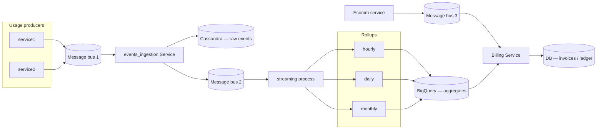

# Billing system — requirements and design

This note matches the architecture in `Billing Service_.drawio.png` under the Java package `com.kumar.interview.prep.system.design.billing`.

---

## Detailed description

### Purpose

The system solves **metered billing at scale**: many small usage signals over time must be turned into **auditable aggregates** and then into **commercially correct invoices**, while **subscriptions and catalog data** evolve on a different cadence than raw usage.

Typical motivating examples: API metering, CDN/data transfer, seat-based plus overage, marketplace take rates, credits, and prepaid accounts.

### Scope

**In scope (as reflected in the diagram):**

- Ingestion of high-volume usage events from heterogeneous producers.
- Durable persistence of acceptable raw events for replay and investigation.
- Stream-oriented rollups across **hourly**, **daily**, and **monthly** windows into an analytical tier.
- Ingest of lower-volume **commercial** events from an ecommerce domain (orders, plan changes, entitlements—exact entities are domain-specific).
- A **billing core** that fuses aggregates with commercial truth and persists **authoritative billing state**.

**Explicitly bounded (diagram does not prescribe implementation detail):**

- Payment capture (Stripe, ACH, PSP webhooks)—often modeled as downstream of invoice issuance.
- Full tax engine—referenced only as something the billing tier may orchestrate.

### Key concepts

| Concept | Meaning |
|--------|---------|
| **Usage event** | Immutable fact: who, what meter, how much, when (and optional dimensions: region, tier, feature key). |
| **Aggregate** | Summarized usage for a window and grouping key (e.g. account + meter + day). |
| **Commercial snapshot** | Effective-dated view of what the customer is entitled to and at what price. |
| **Rating** | Applying price, discounts, credits, and policies to quantities to produce monetary line items. |
| **Invoice / ledger** | Durable, strongly consistent record of what is owed and how it was computed. |

### End-to-end lifecycle (narrative)

1. Producers emit usage continuously; volume is high and spiky.
2. Ingestion normalizes and stores each event as the **system of record for raw usage** (subject to retention policy).
3. A streaming layer projects that stream into **pre-aggregated tables** suitable for analytics and for feeding rating jobs.
4. Commercial changes arrive asynchronously; they are lower volume but drive **which rules apply** when usage is rated.
5. Billing runs (batch, micro-batch, or triggered) read **aggregates** and **commercial context**, write **invoices and balances** to an OLTP database, and emit downstream events (e.g. “invoice finalized”).

---

## Design explanation

### Architecture overview

The design is **event-driven** and **pipeline-oriented**: each stage has a different **throughput, consistency, and query** profile, so it uses different storage and compute patterns.

### Components (what each box is for)

1. **`service1` / `service2`**  
   Domain services that **emit usage**; they should not know invoice schema. They publish **well-versioned events** with stable identifiers (tenant, account, meter, idempotency key).

2. **First message bus**  
   **Decouples** producers from ingestion: absorbs spikes, allows fan-out, and supports consumer groups for scaling ingestion without changing producers.

3. **`events_ingestion Service`**  
   The **edge of trust** for raw usage: schema validation, clock skew policy, dedupe, optional enrichment (e.g. resolve internal IDs), dead-lettering bad messages, and **write to durable raw storage**. It may also **re-publish** a cleaned canonical stream for downstream analytics.

4. **Cassandra (raw events)**  
   Chosen in the diagram for **high write throughput**, horizontal scale, and **time-series friendly** access patterns. It holds the **evidence trail** for “what actually happened” before aggregation—useful for disputes, backfill, and recomputing aggregates when logic changes.

5. **Second message bus**  
   Separates **ingestion completion** from **stream processing** so aggregators can be scaled, upgraded, or replayed independently; also avoids coupling streaming lag to API latency at the edge.

6. **`streaming process` (hourly / daily / monthly)**  
   **Windowed aggregation**: tumbling or sliding windows over the stream (or over ordered data read from raw storage). Multiple granularities exist because **product and finance** need different SLAs: operations may care about hours; billing cycles care about days and months.

7. **BigQuery (aggregates)**  
   An **analytical warehouse**: cheap storage and SQL for large scans, reconciliation across accounts, finance reporting, and ad-hoc investigation. It is **not** the primary home for **strongly consistent** “money truth”—that stays in `DB` behind the Billing Service.

8. **`Ecomm service` + third bus**  
   Carries **commercial facts**: new subscription, plan upgrade, contract effective date, credits, tax profile pointers, etc. Volume is usually far below usage; **ordering per customer** may matter more than raw QPS.

9. **`Billing Service`**  
   **Orchestrates rating and persistence**: loads or subscribes to commercial changes, reads usage aggregates (from BigQuery or via push into a staging area), applies **effective-dated** rules, handles rounding and currency, and commits **invoices / ledger lines** to `DB`. It may run as scheduled jobs plus reactive handlers for mid-cycle corrections.

10. **`DB` (OLTP)**  
    **Source of truth** for money owed, invoice status, adjustments, and idempotent **invoice generation** keys. Expect **transactions**, constraints, and audit trails here.

### Why this split (tradeoffs)

| Concern | Approach in design |
|--------|---------------------|
| **Write flood on usage** | Bus + Cassandra-style raw store; avoid writing every event into a row-oriented OLTP invoice DB. |
| **Correct money** | Centralize mutations in Billing Service → transactional `DB`; aggregates are inputs, not substitutes for ledger. |
| **Replay / recomputation** | Raw store + reproducible aggregation jobs heal logic bugs without re-instrumenting all producers. |
| **Heavy analytics** | BigQuery offload keeps billing OLTP predictable. |
| **Coupling** | Async boundaries between domains; explicit contracts on event schemas and versioning. |

### Data consistency and ordering

- **At-least-once** delivery across buses is typical; correctness relies on **idempotency keys** at ingestion and in billing jobs.
- **Usage** and **commerce** evolve independently; rating must use **as-of semantics** (e.g. price effective at end of billing period, or contractual rule for mid-cycle upgrades).
- **Aggregates lag** raw events—invoice runs must declare whether they wait for watermark completeness or tolerate late data via **supplemental runs** / **credit memos**.

### Failure modes (how the design behaves)

- **Producer duplicates** → dedupe at ingestion using stable event identifiers.
- **Consumer crash** → partition offsets / replay from bus; Cassandra prevents permanent loss once committed.
- **Late events** → may land in next window or trigger **adjustment workflows** depending on policy.
- **Warehouse unavailable** → delay rating job or fallback to aggregates materialized elsewhere (operational tradeoff—not shown in diagram).
- **Commercial message reordering** → per-customer partitioning or versioning of commercial state to reject stale updates.

### Operational hooks

- **Metrics**: ingestion lag, bus consumer lag per stage, Cassandra write errors, aggregation job latency, billing job duration, invoice error rate.
- **Tracing**: correlation id from producer through ingestion into aggregate keys and invoice id.
- **Backfill**: replay from raw store through streaming or batch ETL into BigQuery when definitions change.

---

## Functional requirements

1. **Usage event capture** — Upstream services (e.g. `service1`, `service2`) must be able to publish usage or metered events to a shared messaging layer without tight coupling to billing internals.

2. **Durable raw event storage** — The events ingestion service must persist every accepted event (or an auditable representation) so events are not lost if downstream processing lags or fails.

3. **Validated ingestion** — The ingestion path must reject or quarantine malformed events, enforce required fields, and support traceability (e.g. source, timestamp, tenant).

4. **Time-windowed aggregation** — A streaming process must compute rollups for at least **hourly**, **daily**, and **monthly** windows from the event stream (or from raw storage via replay), suitable for reporting and rating.

5. **Analytical store for aggregates** — Aggregated usage must be available in a warehouse (e.g. BigQuery) for analytics, reconciliation, and large historical queries without overloading operational databases.

6. **Commerce / subscription integration** — The system must incorporate commercial context (orders, subscriptions, contracts, SKUs) from an e‑commerce-oriented service (`Ecomm service`) via asynchronous messages.

7. **Rating and invoicing** — The billing service must combine aggregated usage with commercial rules to produce authoritative billing artifacts (e.g. invoice line items, balances, billing periods) stored in its primary transactional database (`DB`).

8. **Idempotent processing** — Replayed or duplicate messages must not double-charge customers; ingestion and downstream consumers must support deduplication keys or equivalent safeguards.

9. **Reconciliation support** — Operators must be able to compare raw events, aggregates, and final invoices for a given customer and period.

## Non-functional requirements

1. **Scalability** — Ingestion and stream processing must scale independently with event volume; the billing OLTP tier must sustain invoice generation peaks without collapsing shared infrastructure.

2. **Availability** — Core paths (publish, ingest, eventual aggregation) must meet agreed SLOs; billing DB and rating logic should degrade gracefully under partial outages (clear failure modes, retries).

3. **Latency** — Near–real-time aggregates are desirable for dashboards; final invoicing may be batch or periodic, with bounded delay from period close to invoice availability.

4. **Durability and consistency** — No silent loss of billable events; strong consistency expectations for persisted invoices and ledger state in `DB`; clear eventual-consistency boundaries for aggregates.

5. **Security and compliance** — Encryption in transit and at rest, least-privilege access to PII and payment-related data, audit logs for config and invoice changes, retention aligned with regulation.

6. **Observability** — Metrics, logs, and traces across queues and services to debug lag, skew, and incorrect charges; alerting on backlog growth and failed consumption.

7. **Extensibility** — Schema evolution for events and aggregates; ability to add new meters, pricing dimensions, or tax rules without rewriting the entire pipeline.

8. **Cost efficiency** — Tiered storage (hot operational vs analytical warehouse); avoid unnecessary full scans on hot paths during rating.
