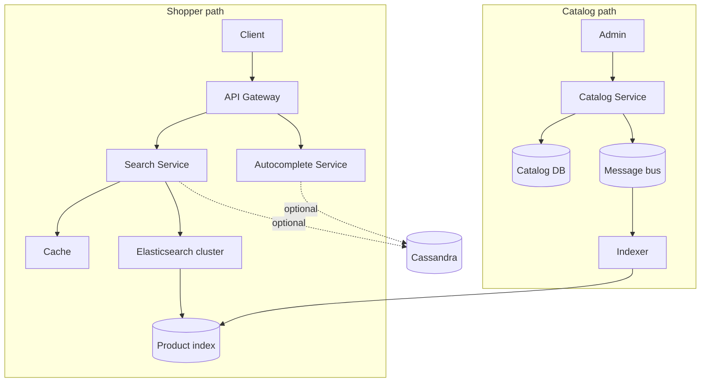

# E‑commerce search & catalog — requirements and design

Diagram: `Ecomm Search System design.png` · Package: `com.kumar.interview.prep.system.design.ecom_search`

---

## Detailed description

### Purpose

Offer **fast product discovery** (search + autocomplete) to shoppers while administrators maintain a **canonical catalog**. The search index is **derived** from the catalog: writes go to the system of truth, then propagate **asynchronously** to Elasticsearch (or similar) via a message bus and indexer.

The diagram also places **Cassandra** for **high-volume auxiliary data** (e.g. search history, sessions, behavioral signals)—off the hot path of simple keyword search if desired.

### Read vs write split

| Path | Goal |
|------|------|
| **User read path** | Low-latency query, suggest-as-you-type, filters/facets. |
| **Admin write path** | Correct catalog mutations, auditability, relational integrity. |
| **Index path** | Eventually consistent mirror optimized for inverted indexes and scoring. |

---

## Scope

**In scope**

- Shopper **client** → **API gateway** (auth + LB) → **Search** and **Autocomplete** services.
- **Cache** in front of hot search reads.
- **Elasticsearch cluster** + **product index** as query engine.
- **Admin** → **Catalog service** → **catalog DB** as source of truth.
- **Event bus** + **indexer** to refresh search documents.
- **Cassandra** for scale-out, high-write accessory data (per diagram placement).

**Out of scope**

- Full ranking ML stack (Learning-to-Rank) — can layer above the same index.
- Global multi-region conflict resolution beyond “catalog DB is authoritative”.

---

## Functional requirements

1. **Keyword search** — Users run text queries with acceptable relevance; support filters (category, price band, attributes) as the product domain requires.

2. **Autocomplete / typeahead** — As users type, return ranked suggestions with tight latency SLOs.

3. **Catalog CRUD** — Admins create, update, delete products and related entities in the **catalog DB** through the catalog service.

4. **Index freshness** — After catalog changes, the **product index** reflects updates within a defined **eventual consistency** bound (seconds to minutes by policy).

5. **Gateway security** — API gateway authenticates and authorizes callers; rate limits abuse.

6. **Auxiliary high-volume data** — System can record or serve high-cardinality data (e.g. impressions, history) via Cassandra without overloading the catalog RDBMS.

7. **Degraded search** — If search cluster is impaired, return graceful errors or limited results per policy (optional cache-only mode when safe).

8. **Schema mapping** — Indexer maps catalog entities to search documents with versioned mapping for evolution.

## Non-functional requirements

1. **Search latency** — Autocomplete and search P99 targets appropriate to web UX (often tens of ms at cache+ES, excluding client network).

2. **Scale** — Handle large catalogs and concurrent queries via horizontal scaling of gateway, search nodes, and cache.

3. **Availability** — Read path survives indexer lag; writes to catalog succeed even if indexing is temporarily down (queue buildup).

4. **Consistency model** — **Strong** for catalog DB mutations; **eventual** between DB and search index—document for PMs and shoppers.

5. **Durability** — No acknowledged catalog write lost; message bus retains events until indexer commits.

6. **Observability** — Metrics on indexer lag, ES health, cache hit ratio, zero-result queries.

7. **Security** — Least-privilege credentials for indexer; no admin paths exposed on public gateway routes.

---

## Design explanation

### Architecture overview

### Component notes

- **API Gateway** — Central TLS, auth, routing, request ids; can cache public read responses at edge sparingly.
- **Search Service** — Builds ES queries, applies business rules (hide out-of-stock, regional assortment), merges cache layers.
- **Autocomplete** — Often separate index prefix, n-gram, or completion suggester for speed.
- **Cache** — Popular queries and facet payloads; **invalidate** on broad catalog changes or short TTL.
- **Catalog service** — Validates invariants, emits **domain events** (product.updated, sku.deleted).
- **Indexer** — Idempotent consumers; handles **retries**, **ordering per product id**, and **bulk** ES updates.
- **Cassandra** — Time-series or wide-row patterns for signals; not a substitute for transactional catalog.

### Tradeoffs

| Topic | Diagram choice | Implication |
|-------|----------------|-------------|
| Async index | Message bus | Lag + simpler search tier; need monitoring |
| ES as engine | Rich query | Ops cost, mapping discipline |
| Cache | Speed | Staleness vs catalog/index |

### Failure modes

- **Indexer stall** — Search stale; alert on lag; possibly pause “just published” banners.
- **ES red cluster** — Fail over to replicas; read-only mode if needed.
- **Duplicate events** — Idempotent updates by document version or last-write metadata.
