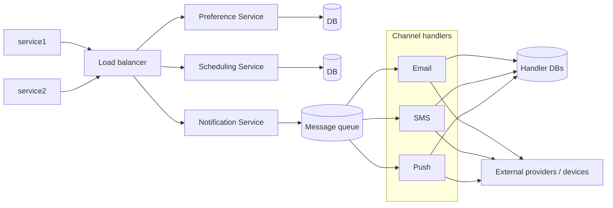

# Notification system — requirements and design

Diagram: `Notification System Design.drawio.png` · Package: `com.kumar.interview.prep.system.design.notification_service`

---

## Detailed description

### Purpose

Provide a **central notification platform**: many product teams (`service1`, `service2`, …) trigger messages; the platform **respects user preferences**, supports **immediate and scheduled** delivery, and fans out to **channel-specific workers** (email, SMS, push) backed by queues for resilience and burst absorption.

### Main paths

| Path | Description |
|------|-------------|
| **Request intake** | Producers → load balancer → core services coordinating a single logical “send”. |
| **Preferences** | Per-user/channel opt-in, quiet hours, categories; read before enqueue or before send. |
| **Scheduling** | Future-dated notifications stored and released by a scheduler service. |
| **Async delivery** | Notification service enqueues work; workers integrate with ESP/SMS/push providers. |

---

## Scope

**In scope**

- Multi-tenant producers sending notification requests through a **load-balanced** API tier.
- **Preference service** with its own database for durable user settings.
- **Notification service** as orchestration / validation / enqueue.
- **Scheduling service** with its own database for delayed jobs.
- **Message queue** decoupling intake from delivery.
- **Channel handlers**: Email, SMS, Push (extensible worker model).
- Persistence for **templates**, **delivery state**, or **audit** (databases adjacent to handlers in diagram).

**Out of scope**

- Exact third-party vendors (SendGrid, Twilio, FCM)—represented generically as external endpoints.
- Full marketing campaign segmentation / A-B testing—could sit above this platform.

---

## Functional requirements

1. **Multi-channel delivery** — Support **Email**, **SMS**, and **Push**; allow adding new channels via new consumer types.

2. **Producer integration** — Upstream services submit requests through the load-balanced entry without tight coupling to a specific channel implementation.

3. **User preferences** — Retrieve and enforce rules (opt-in/out per channel or category) before sending or at dequeue time with consistent policy.

4. **Immediate send** — Notifications without a future schedule are processed through the queue and channel workers as soon as capacity allows.

5. **Scheduled send** — Scheduling service accepts **run-at** semantics, persists jobs, and triggers enqueue at the appropriate time.

6. **Reliable handoff** — Notification service hands work to a **durable queue** so transient downstream failures do not drop accepted requests.

7. **Template and personalization** — System can resolve templates and merge fields (storage implied by handler-side DBs).

8. **Delivery tracking** — Persist status transitions (queued, sent, failed, bounced) for support and retries.

9. **Idempotency** — Duplicate producer submissions with the same logical id do not multiply user-visible sends (policy-level).

## Non-functional requirements

1. **Scalability** — Horizontal scale of stateless API instances, queue partitions, and channel workers independently.

2. **Availability** — Partial failure of one channel must not block others; queue absorbs producer spikes.

3. **Latency** — Time-sensitive notifications meet P95/P99 enqueue and delivery SLOs per channel.

4. **Durability** — Accepted jobs survive process restarts (queue + DB backing schedulers and state).

5. **Security** — AuthN/Z for producer APIs, PII minimization in logs, secrets for provider credentials.

6. **Compliance** — Opt-out honored; retention and audit for regulated industries.

7. **Observability** — Queue depth, DLQ rate, per-channel error rates, end-to-end tracing.

8. **Cost control** — Rate limits and quotas per tenant to protect providers and budgets.

---

## Design explanation

### Architecture overview

### Component notes

- **Load balancer** — Terminates TLS, routes to healthy instances, optional WAF/rate limit at edge.
- **Preference Service** — Read-heavy; cache hot paths; strong consistency for legal opt-out.
- **Notification Service** — Validates payload, resolves recipient, checks preferences, chooses template, **enqueues** canonical work items.
- **Scheduling Service** — Time wheel / DB polling / dedicated scheduler cluster; clock skew and **missed fire** recovery matter.
- **Queue** — Ordering per user may reduce notification storms; DLQ for poison messages.
- **Handlers** — Isolate provider SDKs, retries with backoff, respect provider rate limits.

### Tradeoffs

| Topic | Option A | Option B |
|-------|----------|----------|
| Preference check | Before enqueue (fewer junk jobs) | At send (fresher prefs) |
| Ordering | Global FIFO | Per-user partition ordering |
| Push offline | Drop to push worker failure path | Fallback to SMS/email (policy) |

### Failure modes

- **Queue backlog** → scale consumers; shed load from non-critical tenants.
- **Provider outage** → retry with jitter; DLQ + manual replay.
- **Scheduler clock skew** → use reliable time source; monotonic job ids.
