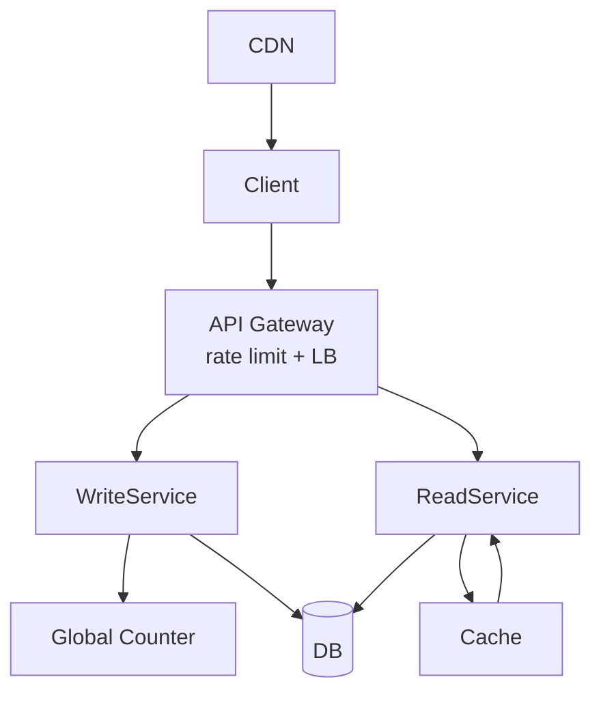

# URL shortener — requirements and design

Diagrams: `tinyUrls.png`, `tiny_urls_educative.png` (same package) · Package: `com.kumar.interview.prep.system.design.url_shortner`

---

## Detailed description

### Purpose

Generate **short, unique keys** that map to long URLs and resolve them with **minimal latency** at massive read volume. The diagram stresses **separation of read and write paths**, **rate limiting** at the edge, a **global counter** (or equivalent) for ID allocation, and a **cache** to shield the database on redirects.

### Core flows

| Flow | Steps (conceptual) |
|------|---------------------|
| **Create** | Client → API Gateway → **WriteService** → obtain unique id (e.g. from **Global Counter**) → persist `(short_key, long_url, metadata)` → return short link. |
| **Resolve** | Client → API Gateway → **ReadService** → **cache** hit returns `301/302` target; miss → **DB** → populate cache → redirect. |

### CDN note

Diagram shows **CDN → Client**: static assets or edge-cached redirect responses may use CDN in some deployments; dynamic create/resolve often still hits origin or regional POP with cache rules.

---

## Scope

**In scope**

- **API Gateway** with **rate limiting** and **load balancing**.
- **WriteService** and **ReadService** as logically separated scalability units.
- **Global Counter** as an ID generation aide (conceptual—could be DB sequence shard, Snowflake-like service, etc.).
- **Database** storing authoritative mappings (and metadata: TTL, creator, analytics keys).
- **Cache** for hot keys on the read path.
- Basic **analytics** hooks implied by IDs and logging (not fully detailed).

**Out of scope**

- Custom domain per tenant at scale (could extend gateway + DNS).
- Malware scanning every long URL unless added as preprocessing.

---

## Functional requirements

1. **Short link creation** — Authenticated or open API (policy) accepts a long URL (+ options), returns a unique short code or full short URL.

2. **Redirect resolution** — Given a short code, respond with HTTP redirect to the stored long URL (or JSON for API clients).

3. **Uniqueness** — No two active mappings share the same short code; collision handling is defined (retry, counter range).

4. **Global ID allocation** — Write path uses a coordinated **counter or ID service** to produce dense, URL-safe tokens at high throughput.

5. **Read/write separation** — Reads and writes can scale independently (separate services and capacity).

6. **Edge protection** — Gateway enforces **rate limits** per key/IP/tenant to mitigate abuse and DB stampedes.

7. **Optional metadata** — Store expiration, custom alias (if allowed), creator id; enforce on read.

8. **Cache population** — On cache miss, read path loads from DB and refreshes cache with a defined TTL or LRU policy.

9. **Invalid / expired links** — Return appropriate HTTP status and body when code unknown or expired.

## Non-functional requirements

1. **Read latency** — Redirect path P99 dominated by cache hits; DB fallbacks stay within SLO under normal load.

2. **Read throughput** — Horizontally scale **ReadService** and cache layer; consider multi-level cache.

3. **Write throughput** — Global counter and write path must not serialize on a single DB row for all traffic (shard, range allocation).

4. **Availability** — Survive single instance failures; DB replication; cache cold start plan.

5. **Durability** — No acknowledged create lost; redirects never return wrong URL for a given code (strong per-key consistency).

6. **Security** — Block open redirects to internal networks if policy requires; abuse detection; audit sensitive creates.

7. **Observability** — QPS, cache hit ratio, counter lag, DB replication health, top codes.

---

## Design explanation

### Architecture overview

### Component notes

- **API Gateway** — Central place for throttling, auth, request validation, DDoS mitigation hooks.
- **Global Counter** — Could be: Redis INCR range fetch, DB `SEQUENCE` per shard, Snowflake node, or pre-generated bulk keys in object storage.
- **WriteService** — Encoding base62/64 of id, reserved word checks, optional **hash of URL** for deduplication (product choice).
- **ReadService** — Extremely lean; **301** vs **302** affects analytics and caching; **307** for method preservation rarely needed here.
- **Cache** — Redis/Memcached cluster; **hot keys** (viral links) may need local L1 or replication.
- **DB** — Sharded by key hash or range; replication for HA; consider **read replicas** for scale if cache miss budget allows stale—usually redirects want strong consistency.

### Tradeoffs

| Topic | Option | Tradeoff |
|-------|--------|----------|
| Encoding | Counter → base62 | Predictable unless obfuscated |
| Dedup same URL | Return existing short | Saves space; privacy leakage across users |
| 301 vs 302 | 302 counts each click via origin | 301 caches at browser/CDN |

### Failure modes

- **Counter outage** → pause creates or failover to alternate allocator.
- **Cache stampede** on viral key → single-flight / request coalescing.
- **DB hotspot** → shard by code hash; avoid global secondary index contention.
