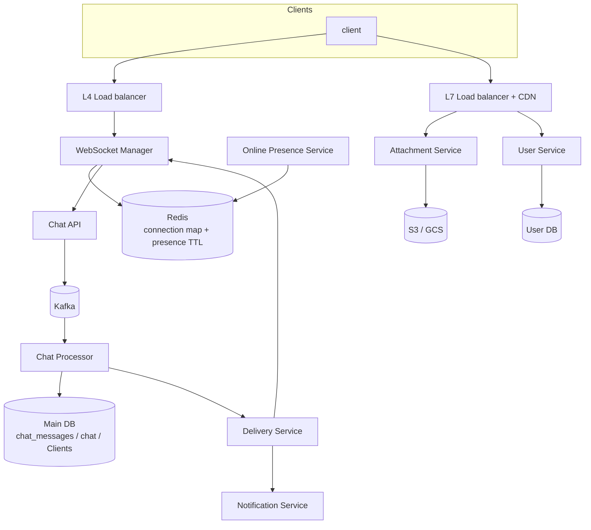

# Real-time chat (WhatsApp-style) — requirements and design

Diagram: `whatsapp system design.drawio (3).png` · Package: `com.kumar.interview.prep.system.design.whatsapp`

---

## Detailed description

### Purpose

Deliver **instant messaging** with **online presence**, **durable chat history**, and **rich media**, while separating **long-lived realtime connections** from **stateless REST** APIs. The diagram uses **L4 LB** for WebSockets, **L7 LB + CDN** for HTTP APIs, **Redis** for connection registry and presence TTLs, **Kafka** for buffering between ingest and persistence/delivery, and a **relational or wide-column main DB** for messages and chats.

### Two planes

| Plane | Protocol | Responsibility |
|-------|----------|----------------|
| **Realtime** | WebSocket (via L4) | Bi-directional messaging, presence hints, typing (if added). |
| **Application** | HTTP/REST (L7) | Profiles, auth, attachments upload metadata, device registration. |

---

## Scope

**In scope**

- Clients → **L4 load balancer** → **WebSocket Manager** with **Redis** mapping (`user → connection`, TTL, status).
- **Online Presence Service** reading/writing Redis.
- **Chat API** receiving messages from WebSocket layer → **Kafka** → **Chat Processor** → **DB** (`chat_messages`, `chat`, `Clients` tables in diagram).
- **Delivery Service** resolving recipient connections and pushing via WebSocket Manager.
- **Attachment Service** + object storage (**S3/GCS**).
- **User Service** + dedicated **DB**.
- **Notification Service** for offline users (push).

**Out of scope**

- E2E encryption key management (Signal protocol)—not shown; can be layered on payloads.
- Full global multi-region active-active—diagram is single-region style.

---

## Functional requirements

1. **Real-time messaging** — Users send messages that appear on recipient devices with low latency when online.

2. **Group and 1:1 chats** — Data model supports multiple participants per `chat` (exact membership rules in service layer).

3. **Message persistence** — Accepted messages are stored in **DB** with sender, chat id, timestamps, and content or reference for media.

4. **Ordering** — Per-chat message order is preserved for consumers (Kafka partition key = `chat_id` is a common pattern).

5. **Presence** — Show online/offline (and optional last seen) using Redis-backed state with TTL for stale connections.

6. **Connection registry** — WebSocket Manager registers sessions in Redis; Delivery Service looks up recipient’s active node.

7. **Attachments** — Clients upload files via Attachment Service to object storage; messages reference stored objects.

8. **User profiles** — User Service provides identity, settings, and auth-related data.

9. **Offline delivery** — If recipient has no active WebSocket, **Notification Service** delivers push; message awaits on next sync.

10. **History sync** — Clients can fetch historical messages via API (pagination cursors) consistent with stored order.

## Non-functional requirements

1. **Latency** — End-to-end delivery P99 in low hundreds of ms within region under normal load.

2. **Scale** — Horizontal scale of WebSocket nodes, Kafka partitions, and stateless APIs; Redis cluster for connection map.

3. **Availability** — Kafka buffers during processor outages; WebSocket reconnect storms mitigated with backoff.

4. **Durability** — No committed message lost after Kafka ack policy and DB commit (define idempotency on consumer).

5. **Consistency** — Strong per-message record in DB; eventual cross-device read consistency bounded by sync.

6. **Security** — TLS everywhere, auth tokens for WS upgrade, least-privilege access to storage and DB.

7. **Observability** — Connection counts, Kafka lag, delivery failures, presence anomalies, attachment upload errors.

---

## Design explanation

### Architecture overview

### Component notes

- **L4 vs L7** — WebSockets need **connection stickiness** or shared connection state (here: **Redis** as source of which server holds a user).
- **WebSocket Manager** — Heartbeats detect dead TCP; TTL in Redis expires ghost sessions.
- **Chat API** — Validates auth context, normalizes message, produces to Kafka with key for ordering.
- **Chat Processor** — Idempotent insert (message id); may trigger side effects (receipts, unread counts).
- **Delivery Service** — Fan-out to each recipient; for groups, consider per-member delivery records.
- **Notification Service** — Batching, collapse keys, respect user notification settings.

### Tradeoffs

| Topic | Pattern | Note |
|-------|---------|------|
| Kafka in path | Durability + decouple | Adds small latency vs direct DB write |
| Redis session | Fast lookup | Must handle failover and hot keys |
| Attachment direct upload | Presigned URL to bucket | Offloads bytes from app servers |

### Failure modes

- **Redis unavailable** — Degrade presence; connection routing may fail—need backup gossip or sticky LB only (limited).
- **Processor lag** — Kafka backlog; clients see delayed delivery but not loss (until retention exceeded).
- **Duplicate delivery** — At-least-once Kafka; clients dedupe by **message_id**.
